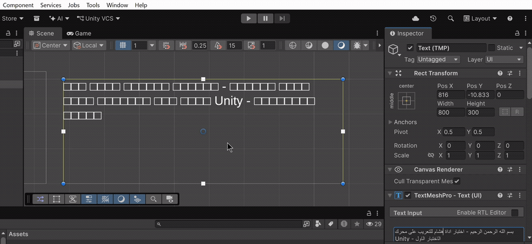

# HeshamRTL

Make Arabic render correctly in Unity, without shipping a single line of runtime code.

*One click: shape the letters, flip the direction right to left, and fix the line wrapping. No code, nothing shipped at runtime.*

HeshamRTL is a Unity Editor tool. It takes your Arabic translation and bakes it, at edit time, into text that already has its letters shaped, its direction reversed, and its line breaks worked out. You press a button, the baked text is saved as normal game data, and that is what ships. There is no runtime library to import, no DLL, no component ticking every frame. Nothing gets added to your build.

The idea is simple. Arabic stops being a special engineering project and becomes just another language you add to your game. You drop it in the way you would drop in French, instead of skipping it because "Arabic needs RTL work."

*Built and maintained by [Hesham](https://heshamlocalization.com), who localizes games into Arabic for a living. This tool is the free, do-it-yourself version of that work.*

## The problem

TextMeshPro was not built with Arabic in mind. Put an Arabic string into a TMP component and you run into four separate problems, usually all at once.

**1. Tofu (empty boxes).** Most game fonts carry no Arabic glyphs, so every letter shows up as an empty square. HeshamRTL bundles an Arabic font and wires it in as a fallback for you, so the glyphs are there.

**2. No letter shaping.** Arabic letters change shape depending on where they sit in a word. TMP does not do this, so letters come out in their isolated forms, disconnected, like writing English with a gap between every letter. The tool reshapes each letter into its correct connected form.

**3. Wrong direction.** Arabic reads right to left, but TMP lays it out left to right, so the line comes out mirrored. The tool reverses the text one line at a time, and it leaves alone the parts that should stay left to right: Latin words, numbers, and things like `config.json`, `v1.2`, or `50%` keep their normal order inside the Arabic.

**4. Line order flips when text wraps.** This is the nasty one. Reverse a whole paragraph, let TMP wrap it, and the lines stack from the bottom up, so the reader gets the last line first. HeshamRTL gets around this by asking TMP itself where it will break the text, measuring against the real box at edit time, then reversing each line on its own. The order stays top to bottom, and because it is already baked, it cannot flip again at runtime.

## How this is different

Other tools solve the Arabic problem at runtime. You add a component to every text object, or you call a convert function on every string before you assign it, and the shaping and reordering happen live while the game runs. That works, and for some cases it is the right call. But it means code runs on every frame a text changes, a library ships inside your build, and you wire that code into every place text appears.

HeshamRTL takes the other road. The shaping, the reordering, and the wrapping all happen once, at edit time, and the result is saved as plain baked text. Nothing from the tool ships in your game. There is no component to add, no function to call, no library in your build. You bake, and the Arabic is just there, sitting in your scene or your String Table like any other text.

That choice is the whole point, and it is worth being clear about the trade:

- **Zero runtime.** The tool is editor-only. Your shipped game carries no part of it, so there is nothing to slow down, nothing to debug at runtime, and nothing extra in your build.
- **No code, no wiring.** You do not touch a single line to make Arabic work. You press a button and the existing TMP boxes, or the Localization table, hold correct Arabic afterward.
- **It meets the professional localization workflow where it lives.** Baking straight into a Unity Localization String Table, with a snapshot so you can always Unbake, is the path real localized games use, and it is not something a per-object runtime component is built for.

And the honest other side: because the text is baked once for a fixed width and size, a runtime approach is the better fit when your text is genuinely dynamic, a field filled at runtime with an unbounded player or item name, or text that must switch between several languages live. HeshamRTL bakes static Arabic beautifully. It is not trying to be a live string converter, and if that is what you need, a runtime tool is the right tool.

## Three ways to bake

Depending on how your project stores its text, you pick one of three. They all share the same shaping and wrapping engine underneath. They differ only in where the Arabic comes from and where the baked result goes.

**Bake a file.** Point the tool at an Arabic YAML, CSV, or JSON file and at the TMP box that will display it. It bakes every Arabic value in the file against that box's width and writes a baked copy next to the original. Good when one file maps to one kind of box.

**Bake the open scene.** This one walks every Arabic `TMP_Text` in the scene you have open and bakes each one in place, measured against its own width and set to NoWrap. Each box gets its own correct wrapping instead of a shared guess. The whole pass is a single undo step.

**Bake a Unity Localization String Table.** This is the path most real localized games actually use. Your strings live in a String Table, and each box pulls its text by key through a `LocalizeStringEvent` at runtime. The tool reads those events to work out which key shows up in which box. It measures each key against the narrowest box it appears in, writes the baked Arabic back into the table, and snapshots every original first, so Unbake can always put things back. This section only appears when the Localization package is installed.

## What it handles

A short rundown of what survives the bake intact:

- **Rich text tags.** Paired tags (`<color>`, `<b>`, `<i>`, `<u>`, `<s>`, `<size>`, `<link>`, and the rest) keep styling the right words, even when a colored phrase wraps across two lines. Standalone tags like `<page>`, ` `, and `<sprite=...>` are kept exactly as they are.
- **Runtime placeholders.** `{0}`, `{1}` and friends pass through untouched, so your code still fills them in at runtime. There is one catch with these, covered below in the limitations.
- **Latin and numbers inside Arabic.** A filename, a version string, a percentage. `config.json`, `v1.2`, `50%` stay in their normal left to right order while the Arabic around them flips.
- **Diacritics and ligatures.** Harakat are preserved, and lam-alef is shaped into its single correct glyph.
- **Re-baking is safe.** Run the tool on a file that is already baked and nothing happens. It recognizes baked text and leaves it alone, so you cannot double bake and corrupt your strings by accident.

File formats, with the details that usually trip people up:

- **YAML** (`.yml`, `.yaml`, `.txt`): keeps your comments, blank lines, and indentation exactly as they were. CRLF line endings are preserved. Only the value inside the quotes gets baked.
- **CSV** (`.csv`): figures out your delimiter on its own (comma, semicolon, or tab), handles RFC-4180 quoting and a UTF-8 BOM, and bakes any cell that contains Arabic while leaving every other column alone.
- **JSON** (`.json`): nested objects and arrays are fine. It bakes string values that contain Arabic and never touches your keys.

## Install

You need Unity with TextMeshPro installed. Any recent TMP version works, since the tool detects the wrapping API by reflection. There are two ways to add it, and both land in the same place.

**Option A: Package Manager (Git URL).**

1. In Unity, open `Window > Package Manager`.
2. Click the `+` in the top left and choose `Add package from git URL`.
3. Paste this and confirm:
   `https://github.com/7akeem0/HeshamRTL.git?path=/HeshamRTL`
4. Let it import. On first import the bundled Arabic font asset generates itself into `Assets/HeshamRTL/Generated/`, and you will see a line in the Console saying the font was generated.

**Option B: Manual copy.**

1. Download or clone this repository.
2. Copy the `HeshamRTL/` folder into your project's `Assets/` folder. Keep the `Editor/` and `Fonts/` split exactly as it comes. Do not flatten it.
3. Let Unity compile and import. On first import the bundled Arabic font asset generates itself next to the font.

Either way, open `Tools > HeshamRTL > Open` and the fallback font field is already filled in. Everything the tool runs is editor-only, so none of it ever ends up in a shipped build.

**Unity versions.** Tested on Unity 6000.5. Other versions most likely work but are not tested yet. If it does not work on your version, email me at hesham@heshamlocalization.com and I will look into it.

For the full setup walkthrough, including a brand new project that has not imported TMP's essential resources yet, see [`HESHAMRTL_SETUP.md`](HeshamRTL/HESHAMRTL_SETUP.md).

## Quick start

1. Open `Tools > HeshamRTL > Open`.
2. Pick how you want to bake: drop in a box and an Arabic file, or bake the open scene, or bake your Localization table.
3. Press Apply.
4. Set the box that displays the baked text to NoWrap. Read the next section, this is the one step you cannot skip.
5. Ship the baked text the way you ship any other game data.

## The one rule you cannot break: NoWrap

The component that displays baked text at runtime must have wrapping turned off.

Set `textWrappingMode` to `NoWrap` (or `enableWordWrapping = false` on older TMP). That is the whole rule. If you remember one thing from this entire document, remember this.

Here is why it matters. The tool already worked out where every line breaks and baked those breaks in. Leave wrapping on, and TMP tries to wrap the already wrapped text a second time. This used to flip the line order so the reader got the bottom line first. Since v1.4 the tool also turns the spaces inside each baked line into no-break spaces, so an accidental re-wrap finds nowhere to break: the worst that happens is a line running a little past the edge, not a flipped order. NoWrap is still the correct setting and the one rule to follow, but forgetting it is no longer a disaster. The scene and Localization bakers set NoWrap for you on the boxes they touch. For a file bake, you set it on the display box yourself.

One more thing worth knowing. If the box is later resized narrower than what you baked for, a line can run past the edge. That is only cosmetic, and a re-bake fixes it. With the no-break-space hardening described above, this overshoot is now the worst case even if NoWrap is forgotten.

## What is tested, and what is not

I would rather tell you exactly where this stands than oversell it. Everything below has either been run in Unity and confirmed on screen, or it is listed plainly as a limitation. Nothing here is wishful.

**Confirmed working, on screen, in Unity:**

- The core: Arabic that is shaped, right to left, and wraps across multiple lines reading correctly from top to bottom.
- Paired tags like `<color>` and `<b>` landing on the right words, including across a wrap.
- Latin and number islands staying left to right inside Arabic.
- `{0}` and `{1}` placeholders, harakat, and lam-alef.
- The re-bake guard.
- The full Unity Localization path end to end: long dialogue, tags, placeholders, per-box widths, the snapshot and Unbake, and picking the narrowest box when a key shows up in several.

**Known limitations, stated plainly:**

- A `{N}` placeholder that gets filled at runtime with open-ended text, a player name or an item name rather than a number, can overflow under NoWrap. Baked wrapping freezes the line breaks for one width at one font size, and an injected name can be wider than any space you reserved. The reserve is adjustable, and the tool logs every entry that has a placeholder so you know which ones to watch. But a truly unbounded field is not a good fit for pre-baked wrapping. Give it a fixed font size sized for the worst case, or shape that one field at runtime.
- The first time a box renders Arabic, if its base font has no Arabic glyphs, you may see a burst of `character not found` warnings in the Console. The fallback font resolves them and the text on screen comes out correct. The Console just is not perfectly quiet yet. It is cosmetic, it only happens at development time, and tidying it up is on the list for later.
- Paired tags still need to be properly nested (no overlapping ranges). Since v1.4 a paired span may cross a ` ` line break (it closes at the break and reopens on the next line) and may sit mid-word without breaking Arabic letter joining.
- Vertical alignment together with pre-baked wrapping has not been stress tested across every possible box setup yet.

**Not supported in this release. Do not assume these work:**

- **Persian and Urdu.** They use the Arabic script with extra letters, so parts may happen to work, but they are not tested and the shaping tables have not been verified for them. Treat them as unsupported.
- **Hebrew.** Hebrew has no letter shaping at all, so the shaping engine does not apply to it. It needs a different code path. Not in this release.
- **Arabic-Indic digits** (`١٢٣`). Deliberately out of scope. The tool works in Western digits, `0` through `9`.

This is an Arabic tool. That is the honest scope of this release, and these limitations are listed on purpose, because knowing exactly what a tool does and does not do is worth more than a longer feature list.

## Planned improvements

A short, honest list, all non-blocking:

- Quieting the first-render `character not found` Console noise described above.
- More stress-testing of vertical alignment together with pre-baked wrap across varied box setups.

## How it works under the hood

The short version is in this README. What changed in each release is in
[`CHANGELOG.md`](CHANGELOG.md) — v1.4.0 is a correctness release: every bake is
now verified against its source before it is written, baked lines resist
accidental re-wrapping, "New York" style Latin runs keep their order, tags can
cross line breaks and sit mid-word, and translator-input quirks (decomposed
hamza, invisible bidi marks) are normalized away. If you want the real detail,
three documents ship inside the tool:

- [`HESHAMRTL_SETUP.md`](HeshamRTL/HESHAMRTL_SETUP.md): full setup, the runtime contract, the safety checks, and troubleshooting.
- [`LOCALIZATION_INTEGRATION.md`](HeshamRTL/LOCALIZATION_INTEGRATION.md): the design behind the String Table baker and the exact Localization API it relies on.
- [`FONT_PACKAGING_NOTES.md`](HeshamRTL/FONT_PACKAGING_NOTES.md): how the bundled font asset is generated instead of shipped, and why.

## Credits and license

Built by Hesham, an Arabic game localization specialist.

This tool covers the do-it-yourself path. If you would rather hand the whole job over, the translation, the shaping, and the testing, that is the service I run at [heshamlocalization.com](https://heshamlocalization.com).

- GitHub: [7akeem0](https://github.com/7akeem0)
- X / Twitter: [@Arabic_Hesham](https://twitter.com/Arabic_Hesham)
- Site: [heshamlocalization.com](https://heshamlocalization.com)

The shaping and reversal core comes from the author's own open-source Sutoor (سطور) toolkit, rewritten in C# and extended to ask TextMeshPro for real wrap positions at edit time.

**License.** HeshamRTL is released under the PolyForm Noncommercial License 1.0.0, with one plain-language exception spelled out at the top of the [`LICENSE`](LICENSE) file. You are free to use the tool to localize your own game, including a commercial game you sell, at no cost, and the baked text it produces is entirely yours. What the license does not allow is selling the tool itself, selling a modified version of it, or bundling it into another product or service that is sold. In short, making money from your game is fine; making money from the tool is not. The full terms are in [`LICENSE`](LICENSE).

The bundled font, Noto Kufi Arabic, is separate. It is licensed under the SIL Open Font License 1.1, and that license sits next to the font in [`Fonts/OFL.txt`](HeshamRTL/Fonts/OFL.txt). Using it as a fallback puts no restriction on the game you make.
